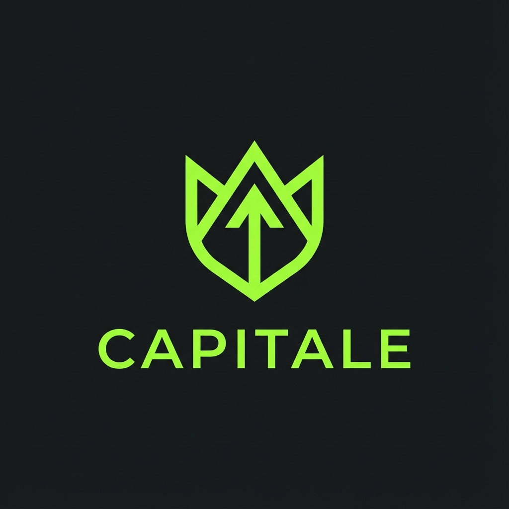

<p align="center">
  
</p>

# Capitale — Wealth Strategy Protocol

**MoneyVisualizer** — это веб-приложение для визуализации долгосрочного влияния ежемесячных накоплений и сложных процентов. Цель проекта — сделать невидимый рост денег наглядным и системным.


---

## Основные возможности

-   **Визуализация роста:** Интерактивный график (Area Chart), разделяющий вложенный капитал и накопленные проценты.
-   **Интерактивные параметры:** Мгновенное обновление данных при изменении стартового депозита, ежемесячного взноса или процентной ставки.
-   **Метрики успеха:** Расчет итогового баланса, мультипликатора капитала и потенциального пассивного дохода.
-   **Reality Check:** Перевод пассивного дохода в реальные категории расходов (от подписок до недвижимости).
-   **Ретроспектива:** Анализ исторических данных мировых индексов и акций.
-   **Mobile-First:** Премиальный дизайн, оптимизированный для любых устройств.

---

## Как запустить проект локально

### 1. Требования

Убедитесь, что у вас установлены:
-   **Node.js** (рекомендуется версия 18.x или выше)
-   **npm**

### 2. Подготовка директории

Если проект уже находится в вашей директории:
```bash
cd "Money visualizer"
```

### 3. Установка зависимостей

Выполните команду для установки необходимых пакетов:
```bash
npm install
```

### 4. Запуск в режиме разработки

Запустите локальный сервер разработки:
```bash
npm run dev
```

После запуска откройте ссылку в браузере (обычно `http://localhost:5173`).

---

## Технологический стек

-   **Frontend:** React 19 + TypeScript
-   **Сборка:** Vite
-   **Стилизация:** Tailwind CSS
-   **Графики:** Recharts
-   **Иконки:** Lucide React
-   **Локализация:** Custom i18n Protocol (RU/EN)

---

## Структура проекта

-   `src/i18n/` — Система локализации.
-   `src/utils/marketData.ts` — Исторические данные рынков.
-   `src/hooks/` — Бизнес-логика и финансовые расчеты.
-   `src/components/dashboard/` — Основные UI модули.
-   `src/components/articles/` — База знаний.

---

## Сборка для продакшена

Если вы хотите собрать оптимизированную версию приложения:
```bash
npm run build
```
Готовые файлы появятся в папке `dist/`.

---
*Сконцентрировано на финансовой свободе.*
